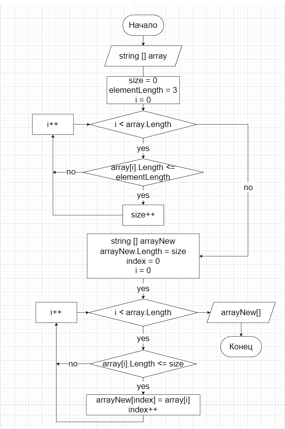

# **Описание решения задачи**

## Условие задачи

Написать программу, которая из имеющегося массива строк формирует массив из строк, длина которых меньше либо равна 3 символа. Первоначальный массив можно ввести с клавиатуры, либо задать на старте выполнения алгоритма. При решении задачи не рекомендуется пользоваться коллекциями, лучше обойтись исключительно массивами.

## Алгоритм решения

## Решение задачи

### Этап 1. Нахождение длины нового массива.

Прежде чем создать новый массив, необходимо узнать длину это массива. Для этого нам понадобятся новые переменные:
* ***elementLength*** = 3 - максимальный размер элемента массива.
* ***size*** = 0 - размер будущего массива.
* ***i*** = 0 - переменная - счетчик, которую будем увеличивать на 1 каждую итерацию, чтобы проверить каждый элемент массива.

Создаём цикл для нахождения элементов массива, длина которых меньше либо равна ***elementLength*** :

1. До тех пор пока ***i*** меньше, либо равна длине массива. Иначе этап 1 завершён и переходим к этапу 2.
2. Если длина строкового элемента массива с индексом ***i*** меньше либо равна ***elementLength***, увеличиваем ***size*** на 1.
3. Увеличиваем ***i*** на 1. Возвращаемся к пункту 1.

### Этап 2. Формирование нового массива
Создаём массив размером ***size***.

Вводим необходимые переменные:

* ***i*** = 0 - переменная - счетчик, которую будем увеличивать на 1 каждую итерацию, чтобы проверить каждый элемент массива.
* ***index*** = 0 - будем увеличивать эту переменную на 1 после заполнения каждого элемента нового массива.

Создаём цикл для нахождения элементов массива строк, длина которых меньше либо равна ***elementLength***, а также заполнения нового массива этими элементами:

1. Пока переменная ***i*** меньше либо равна длине массива. Иначе выходим из цикла.
2. Если длина элемента массива с индексом ***i*** меньше либо равна ***elementLength***, заполняем элемент нового массива c индексом ***index*** значением элемента массива с индексом ***i***, увеличиваем ***index*** на 1.
3. Увеличиваем ***i*** на 1. Возвращаемся к пункту 1.

Конец задачи.